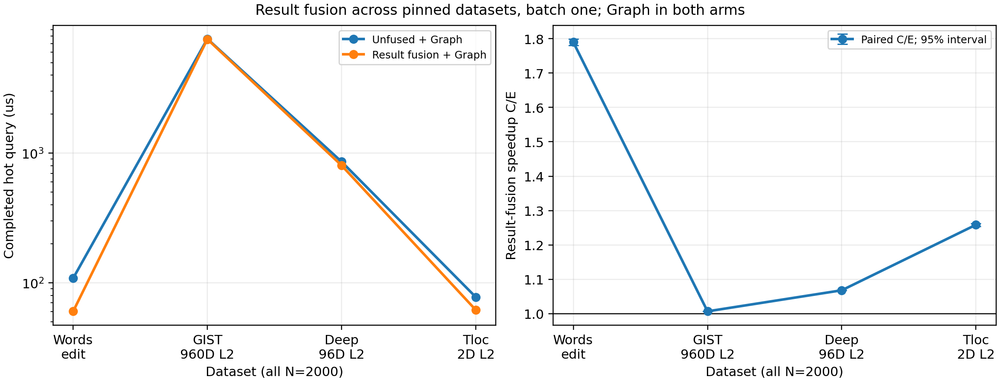

# 结果融合在不同数据集上的效果

四组固定 N=2000 的同卡配对实验已完成。加速比从 GIST 的 **1.007×** 到 Words 的 **1.802×**。
比较 C（原结果整理＋CUDA Graph）与 E（结果融合＋CUDA Graph）。其他遍历、布局、容量和完整输出传输相同。

| 数据集 | 维度/度量 | 正常半径 | 命中中位数 | C μs | E μs | 中位数加速比 | 配对加速比 [95% 区间] | 胜出 |
|---|---|---:|---:|---:|---:|---:|---|---:|
| Words | 字节编辑距离 | 4 | 2 | 108.368 | 60.141 | 1.802× | 1.7898 [1.7799, 1.7994] | 6/6 |
| GIST | 960D L2 | 1.41125 | 50.5 | 7624.763 | 7574.347 | 1.007× | 1.0069 [1.0067, 1.0071] | 6/6 |
| Deep | 96D L2 | 1.07984 | 50.5 | 859.186 | 804.163 | 1.068× | 1.0681 [1.0673, 1.0689] | 6/6 |
| Tloc | 2D L2 | 3.08929 | 50.5 | 77.502 | 61.627 | 1.258× | 1.2586 [1.2543, 1.2630] | 6/6 |

每个数据集做六轮独立进程配对，CE/EC 交替；数据集顺序也交替反转。表中延迟为进程平均查询延迟的中位数；区间来自六轮配对 log 比值的全部 6^6 重采样。不同数据集半径按原 CPU oracle 固定，不能将绝对耗时当成相同难度的横向比较。

Words 绝对节省 48.2 μs，GIST 也节省 50.4 μs；GIST 的整次查询约 7.6 ms，因此同量级的节省只占约 0.7%。此前新布局实验用的就是 GIST/Deep/Tloc 的已融合 E 路径，测到的是布局的额外变化。本轮同卡 C/E 对照显示，换成这些数据集后，结果融合本身的完整查询收益已经不同于 Words 的 1.8×。

## 旧 Words 1.8× 同会话对照

保存的旧二进制在同一 GPU、同一 Words fixture 重测为 108.103 → 60.074 μs，1.800×；配对 1.803 [1.796, 1.812]，6/6 胜出。上表统一新二进制的 Words 点与旧程序分开。

## 结果段归因

旧计数核 `getQresultCount` 在 batch=1 下只由一个线程对候选结果做归约；融合核用一个 512 线程 CTA 合并计数、压紧与写出。当遍历与叶子距离计算占据更多总时间时，减少结果整理的开销对完整查询的相对收益会缩小。Profiler 只用于判断这个方向，不能将单核时间直接从主计时的 64 查询均值相减。

| 数据集 | C kernels/query | E kernels/query | C 计数核 μs（诊断） | E 融合核 μs（诊断） |
|---|---:|---:|---:|---:|
| Words | 24 | 17 | 44.836 | 3.985 |
| GIST | 24 | 17 | 46.865 | 3.985 |
| Deep | 24 | 17 | 46.927 | 4.341 |
| Tloc | 24 | 17 | 5.252 | 2.091 |

每组 NSYS 为 8 个固定查询、8 次预热和一次首次查询（共 17 个执行）。trace 核验 C/E 公共遍历/叶子路径及保留的删除前缀扫描一致；其插桩时间不作为端到端加速比。

## 双顺序长测

| 数据集 | CE 顺序 C/E | EC 顺序 C/E |
|---|---:|---:|
| Words | 1.791× | 1.793× |
| GIST | 1.007× | 1.007× |
| Deep | 1.069× | 1.068× |
| Tloc | 1.260× | 1.263× |

## 验证与口径

- 162 次运行核验预登记的输入、作者源码、生成代码、二进制、阶段顺序及 GPU 监控记录。
- 46 次完整输出：A 与 C/E 的成员、距离、数量和 float32 稳定顺序；覆盖正常、零、全命中与负半径。其中 Words 包含旧二进制的两个完整输出锚点。
- 24 次 sanitizer、8 组连续查询压力、60 组主计时（含 12 个旧程序锚点）、16 组双顺序长测及 8 组 NSYS。所有后续查询核验完整有序输出哈希。
- 主计时预热 64 次；Words/Tloc 每进程 4096 查询，GIST/Deep 512 查询。长测均翻倍。
- 计时包含查询输入、GPU 工作、2,220 槽完整结果回传以及 CPU 等待完成；建树、初始化、Graph 捕获、预热和结果哈希另计。
- RTX PRO 6000、CUDA 13.1.115、sm_120；CPU 共享未绑核，GPU 时钟未锁定。采样监控未发现外部 GPU 进程。
- 结论限定于这些固定 2,000 条数据、各自正常半径和 batch=1；没有百万规模、动态更新或冷启动结果。

[数值表](RESULTS.csv) · [机器可读审计证据](EVIDENCE.json) · [实验约定](CONTRACT.md)
