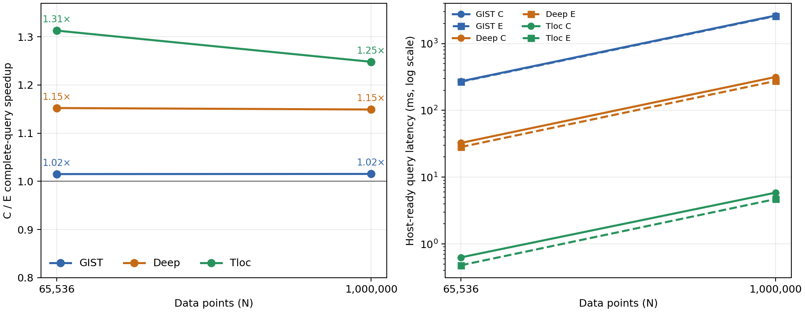

# 结果融合：三组 L2 数据集的大规模实验

在 GIST、Deep、Tloc 的 65,536 和 1,000,000 条真实数据上，对比原结果整理 C 与融合结果整理 E。两组沿用原生布局和遍历、同一半径与输出容量；下表是完整查询的热态 host-ready 延迟。

| 数据集 | N | 命中中位数 | C ms | E ms | 加速比 | 配对比值 [95% 区间] | 胜出 |
|---|---:|---:|---:|---:|---:|---|---:|
| GIST | 65,536 | 4940.5 | 272.039 | 267.979 | 1.015× | 1.0154 [1.0151, 1.0160] | 6/6 |
| GIST | 1,000,000 | 75823 | 2621.946 | 2582.044 | 1.015× | 1.0155 [1.0154, 1.0155] | 6/6 |
| Deep | 65,536 | 1123 | 32.535 | 28.236 | 1.152× | 1.1522 [1.1518, 1.1526] | 6/6 |
| Deep | 1,000,000 | 16535 | 315.482 | 274.533 | 1.149× | 1.1491 [1.1490, 1.1493] | 6/6 |
| Tloc | 65,536 | 1582 | 0.629 | 0.479 | 1.313× | 1.3270 [1.2866, 1.3848] | 6/6 |
| Tloc | 1,000,000 | 25279.5 | 5.848 | 4.685 | 1.248× | 1.2499 [1.2486, 1.2515] | 6/6 |

六轮独立进程 CE/EC 交替配对，并反转数据集及规模顺序。表中 C/E 为进程均值的中位数；配对区间为六轮 log 比值的全部 6^6 重采样。每进程先预热 16 次，65,536 点计时 32 个查询，百万点计时 8 个查询；双顺序长测的查询数翻倍。

保持原生布局时，GIST 百万点的 C/E 每查询节省约 39.9 ms，但原查询约 2.62 s，因此完整查询只快 1.5%；Deep 百万点节省约 40.9 ms，占原查询 315 ms 的约 13%；Tloc 百万点节省约 1.16 ms，占原查询 5.85 ms 的约 20%。这解释了为什么 Words 小规模的 1.8× 不能直接套用到不同维度和距离工作量的数据集。此前新布局实验是在这些数据集已经融合的 E 路径上进行，布局的额外影响应与此处 C/E 收益分开看。

## 双顺序长测与工作量

| 数据集 | N | 树高 | 候选中位数 | 每查询回传 | CE 长测 | EC 长测 |
|---|---:|---:|---:|---:|---:|---:|
| GIST | 65,536 | 5 | 9884.5 | 1.78 MB | 1.015× | 1.015× |
| GIST | 1,000,000 | 6 | 97568.5 | 17.78 MB | 1.015× | 1.015× |
| Deep | 65,536 | 5 | 9995 | 1.78 MB | 1.152× | 1.152× |
| Deep | 1,000,000 | 6 | 99813.5 | 17.78 MB | 1.149× | 1.149× |
| Tloc | 65,536 | 5 | 303 | 1.78 MB | 1.300× | 1.315× |
| Tloc | 1,000,000 | 6 | 2918.5 | 17.78 MB | 1.255× | 1.254× |

固定半径分别取自之前各数据集 2,000 点实验；新增点采用固定种子且保留之前的 2,000 个原始 ID，八个查询源 ID 不变。各数据集维度和命中密度不同，不以跨数据集的绝对延迟比较算法优劣。之前 N=2,000 的 C/E 加速比分别为 GIST 1.007×、Deep 1.068×、Tloc 1.258×；它们是独立实验，不并入本轮统计。

## 结果段归因（诊断性 profile）

| 数据集 | N | C/E kernels/query | C 计数核 ms | E 融合核 ms |
|---|---:|---:|---:|---:|
| GIST | 65,536 | 30/22 | 4.411 | 0.361 |
| GIST | 1,000,000 | 32/24 | 43.903 | 3.689 |
| Deep | 65,536 | 30/22 | 4.558 | 0.300 |
| Deep | 1,000,000 | 32/24 | 45.584 | 4.459 |
| Tloc | 65,536 | 30/22 | 0.189 | 0.018 |
| Tloc | 1,000,000 | 32/24 | 1.562 | 0.140 |

NSYS 每组仅追踪两个固定查询 ID、两次预热、首次调用，共五次执行；核时间受插桩影响，不能直接从主计时相减。trace 核对 C/E 公共遍历与叶子计算内核序列一致，差异在结果整理。

## 正确性与计时口径

- 192 次预登记运行。每个规模的 A/C/E 完整正常半径输出由独立 CPU float64 全矩阵检查：非边界点的成员资格和距离、全体命中数、稳定顺序与 float32 位模式。在百万点另验证零半径、全命中和负半径。C/E 在所有查询上与原路径 A 的有序输出位对位相同。
- 正常半径附近允许绝对/相对容差带，六组八查询中带内点数分别为 GIST 65,536: 16、GIST 1,000,000: 239、Deep 65,536: 1、Deep 1,000,000: 83、Tloc 65,536: 0、Tloc 1,000,000: 10；带外成员资格严格核对。
- 每个规模 C/E 均通过 memcheck、synccheck；百万点 E 另通过 initcheck、racecheck。所有压力测试、主计时、长测和 profile 查询均与 CPU 验证后的原路径完整有序输出哈希一致。
- 计时包含输入查询、GPU 遍历与结果整理、完整固定容量输出回传及 CPU 等待；不含二进制数据载入、建树、Graph 捕获、预热与结果哈希。二进制 loader 仅在建树前替代文本解析，两组路径完全相同。CPU 未绑核，GPU 时钟未锁。
- 硬件为 RTX PRO 6000 Blackwell Server，CUDA 13.1.115；GPU 1 运行期间有外部进程监控。此前 GPU 5 批次因外部进程进入而停止并留档，本表仅使用在同一张 GPU 上重新开始并完整通过核验的批次。结果限定于 batch=1、固定查询与半径、原生布局和当前固定容量结果回传策略。

[原始数值](RESULTS.csv) · [审计证据](EVIDENCE.json) · [预登记约定](CONTRACT.md) · [复现实验说明](README.md)
