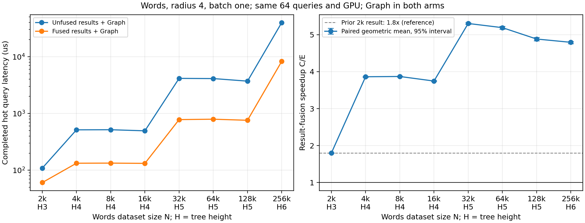

# 结果融合加速随 Words 数据规模变化

完成 2 千至 25.6 万条、8 个规模的同卡配对实验。各规模的中位数加速比范围为 **1.795×–5.318×**。峰值在 32,000 条，最大规模 256,000 条仍为 4.813×。所有规模均为 6/6 轮胜出，双顺序长测也全部胜出。

比较 C（结果未融合＋Graph）与 E（结果融合＋Graph）。不叠加遍历融合或新布局。

| N | 树高 | C：未融合 μs | E：融合 μs | 中位数加速比 | 配对加速比 [95% 区间] | 胜出 |
|---:|---:|---:|---:|---:|---|---:|
| 2,000 | 3 | 108.915 | 60.670 | 1.795× | 1.798 [1.792, 1.804] | 6/6 |
| 4,000 | 4 | 514.703 | 132.977 | 3.871× | 3.862 [3.841, 3.877] | 6/6 |
| 8,000 | 4 | 516.850 | 133.529 | 3.871× | 3.869 [3.855, 3.882] | 6/6 |
| 16,000 | 4 | 494.598 | 132.121 | 3.744× | 3.745 [3.738, 3.757] | 6/6 |
| 32,000 | 5 | 4143.384 | 779.184 | 5.318× | 5.302 [5.279, 5.326] | 6/6 |
| 64,000 | 5 | 4112.625 | 792.033 | 5.192× | 5.189 [5.147, 5.225] | 6/6 |
| 128,000 | 5 | 3705.680 | 758.015 | 4.889× | 4.882 [4.831, 4.923] | 6/6 |
| 256,000 | 6 | 39760.968 | 8260.883 | 4.813× | 4.793 [4.757, 4.818] | 6/6 |

六轮独立进程，CE/EC 交替；偶数轮按 N 递增，奇数轮按 N 递减。中位数取自进程平均查询延迟；置信区间来自六轮配对 log ratio 的全部 6^6 重采样。曲线右图使用配对几何均值，表中另列中位数之比。

## 为什么超过 1.8×，又不是单调增长

主要收益来自消除原结果计数路径的串行扫描。原 `getQresultCount` 按查询分配线程，本轮 batch=1 只有一个线程处理一次查询；本轮二进制的 SASS 确认其归约编译为 LDG → 整数累加 → 回跳的循环。融合实现让一个 CTA 的 512 个线程按 tile 协作，同时完成计数、压紧和 ID/距离写出。因此收益包含算法并行化及减少中间扫描，不能仅归因于少启动几个 kernel。

独立 profiler 的 8 个查询子集中，旧计数核从 N=2000 时的 44.82 μs，增长到 N=32000 时的 3.748 ms 和 N=256000 时的 36.201 ms；对应融合核为 4.03 μs、0.190 ms、2.427 ms。这支持计数瓶颈的归因；profiling 使用查询子集且有插桩，不能与上表 64 查询主计时直接相减。

4 千、3.2 万和 25.6 万条处树高增加，叶子数及槽容量约增十倍，造成延迟阶跃。同一树高内，数据增加会改变枢轴和剪枝后的候选数，例如 3.2 万到 12.8 万条的候选叶子中位数反而下降；所以耗时及加速比不会只随 N 单调增加。公共遍历、叶子计算、固定长度回传及融合核自身成本也继续增长。

## 旧的 1.8× 是否能在本轮复现

保留旧可执行文件，在同一卡、本轮会话、同一 2000 条数据与 64 个查询上重测：**108.933 → 60.561 μs，1.799×**；配对为 1.800× [1.791, 1.808]，6/6 轮胜出。
上表 2000 点使用扩容后的统一二进制；旧程序是单独的同会话桥接对照，未混入规模曲线。

## 规模同时改变了什么

数据是嵌套真实子集，并保留相同的 64 个查询词和半径 4。树高按叶子容量 20 的最坏子分区计算，fanout 10 保持不变。节点与结果工作区按树容量分配，因此在树高跃升处呈阶梯变化。

| N | 节点容量 | 结果槽容量 | 实际叶子数 | 候选节点中位数 | 命中数中位数 |
|---:|---:|---:|---:|---:|---:|
| 2,000 | 111 | 2,220 | 100 | 97 | 2 |
| 4,000 | 1,111 | 22,220 | 1,000 | 947 | 3 |
| 8,000 | 1,111 | 22,220 | 1,000 | 935 | 4.5 |
| 16,000 | 1,111 | 22,220 | 1,000 | 888 | 7.5 |
| 32,000 | 11,111 | 222,220 | 10,000 | 8702 | 14 |
| 64,000 | 11,111 | 222,220 | 10,000 | 8721 | 25 |
| 128,000 | 11,111 | 222,220 | 10,000 | 7498 | 44 |
| 256,000 | 111,111 | 2,222,220 | 100,000 | 84746.5 | 90.5 |

两组在同一 N 使用相同容量和固定长度输出拷贝；E 保留已不用的中间缓冲区，用于隔离结果融合改动。因此该曲线包含真实增长的距离计算、候选/命中集合、工作区扫描和结果传输成本，不是单个融合核的吞吐曲线，也不是内存最优实现。

每查询回传 4 + 槽容量 × 8 字节；25.6 万条时为 17.78 MB，即使命中数较少也回传完整容量。结果只代表当前构树/容量与原计数基线；不能将约 5× 解释为相对另一种已优化并行计数实现的收益。

## 双顺序长测

| N | CE 顺序 C/E | EC 顺序 C/E |
|---:|---:|---:|
| 2,000 | 1.799× | 1.804× |
| 4,000 | 3.879× | 3.870× |
| 8,000 | 3.838× | 3.883× |
| 16,000 | 3.760× | 3.760× |
| 32,000 | 5.286× | 5.331× |
| 64,000 | 5.215× | 5.234× |
| 128,000 | 4.897× | 4.818× |
| 256,000 | 4.820× | 4.805× |

## 验证与计时口径

- 307 次运行均核验回执、二进制、输入哈希与阶段顺序。
- 90 次完整输出检查：原查询路径 A 与 C/E 的成员、编辑距离、数量和稳定顺序；覆盖正常、零半径、全命中与负半径。另包含旧二进制在 2000 条的两个输出锚点。
- 独立 CPU C++ 整数距离矩阵，与原 Python 全表 DP 交叉检查 130 对；所有计时、压力、长测及 profiler 查询核验完整有序输出哈希。
- 40 次完整查询 sanitizer；融合核 176 个独立边界案例经过正常运行和四类 sanitizer，覆盖最大容量、零/稀疏/全命中、尾部污染与非恒等 ID 映射。
- 16 组连续查询压力测试；108 组主计时（含 12 个旧程序锚点）；32 组长测；16 组 NSYS。
- NSYS 验证公共遍历/叶子路径一致、保留删除前缀扫描一致，并核对实际 kernel 数量。Profiler 时长不作为端到端加速比分母。

| N | C kernels/query | E kernels/query | C 计数核 μs（诊断） | E 融合核 μs（诊断） |
|---:|---:|---:|---:|---:|
| 2,000 | 24 | 17 | 44.819 | 4.026 |
| 4,000 | 27 | 19 | 398.450 | 20.375 |
| 8,000 | 27 | 19 | 412.737 | 22.293 |
| 16,000 | 27 | 19 | 401.923 | 21.493 |
| 32,000 | 30 | 22 | 3748.303 | 189.991 |
| 64,000 | 30 | 22 | 3678.008 | 196.049 |
| 128,000 | 30 | 22 | 3246.114 | 174.784 |
| 256,000 | 32 | 24 | 36200.526 | 2427.305 |

主计时包含查询输入、GPU 计算、完整输出传输及 CPU 等待结果就绪；不包含数据加载、建树、一次性工作区准备/Graph 捕获、预热及结果哈希。准备、首次查询、摊销成本和每进程分位数保留在 EVIDENCE.json。
每进程预热 64 次。主计时查询数：N≤16000 为 4096，N≤64000 为 512，128000 为 128，256000 为 64；每个长测进程为相应主计时的两倍。
同一张 RTX PRO 6000、CUDA 13.1.115、sm_120；CPU 共享未绑核，GPU 时钟未锁定。采样监控未发现外部 GPU 进程，但不宣称硬件绝对独占。
本轮只验证 Words、半径 4、batch=1、最高 256000 条及当前工作区策略。不能外推到其他数据集、百万规模、批量查询、动态更新或完整程序冷启动。

[原始数值表](RESULTS.csv) · [机器可读审计证据](EVIDENCE.json) · [实验约定](CONTRACT.md)
