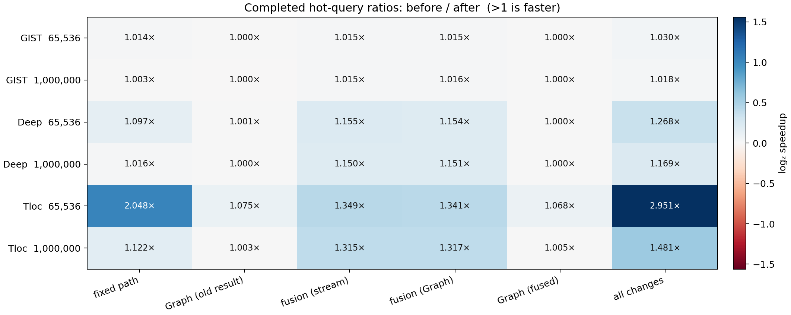

# 大规模端到端收益与对应改进

在 GIST、Deep、Tloc 的 65,536 和 1,000,000 点上，同卡、同输入、同一二进制重新测量五条路径。所有数值是一次完整热查询的 host-ready 耗时；模式 A 是原查询函数，B 是固定容量普通 stream，C 在 B 上加入 CUDA Graph，D 在 B 上加入结果融合，E 同时使用结果融合与 Graph。

| 数据集 | N | A 原路径 ms | B 固定 stream ms | C +Graph ms | D +融合 ms | E 融合+Graph ms | A/E 累计 |
|---|---:|---:|---:|---:|---:|---:|---:|
| GIST | 65,536 | 280.570 | 276.723 | 276.692 | 272.594 | 272.474 | 1.030× |
| GIST | 1,000,000 | 2672.798 | 2665.257 | 2665.826 | 2625.653 | 2625.134 | 1.018× |
| Deep | 65,536 | 36.317 | 33.091 | 33.047 | 28.653 | 28.649 | 1.268× |
| Deep | 1,000,000 | 325.264 | 320.237 | 320.215 | 278.362 | 278.310 | 1.169× |
| Tloc | 65,536 | 1.288 | 0.629 | 0.585 | 0.466 | 0.436 | 2.951× |
| Tloc | 1,000,000 | 5.642 | 5.031 | 5.017 | 3.827 | 3.809 | 1.481× |

表中耗时取四个独立进程均值的中位数。下表比值是两条路径的中位数之比；>1 为右侧改进更快，<1 为退化。括号内是**同一轮**比较时候选胜出的轮数（共 4 轮）。

| 数据集 | N | A/B 固定路径 | B/C Graph | B/D 融合 | C/E Graph 下融合 | D/E 融合下 Graph | A/E 累计 |
|---|---:|---:|---:|---:|---:|---:|---:|
| GIST | 65,536 | 1.014× (4/4) | 1.000× (2/4) | 1.015× (4/4) | 1.015× (4/4) | 1.000× (2/4) | 1.030× (4/4) |
| GIST | 1,000,000 | 1.003× (4/4) | 1.000× (1/4) | 1.015× (4/4) | 1.016× (4/4) | 1.000× (3/4) | 1.018× (4/4) |
| Deep | 65,536 | 1.097× (4/4) | 1.001× (4/4) | 1.155× (4/4) | 1.154× (4/4) | 1.000× (2/4) | 1.268× (4/4) |
| Deep | 1,000,000 | 1.016× (4/4) | 1.000× (4/4) | 1.150× (4/4) | 1.151× (4/4) | 1.000× (3/4) | 1.169× (4/4) |
| Tloc | 65,536 | 2.048× (4/4) | 1.075× (4/4) | 1.349× (4/4) | 1.341× (4/4) | 1.068× (4/4) | 2.951× (4/4) |
| Tloc | 1,000,000 | 1.122× (4/4) | 1.003× (4/4) | 1.315× (4/4) | 1.317× (4/4) | 1.005× (3/4) | 1.481× (4/4) |

A/B 是一整组实现变化：原路径每查询分配/释放临时结果，B 复用固定容量工作区并回传完整槽位。因此 A/B 不能归因于某个单独内核。B/C 与 D/E 分别隔离未融合、已融合条件下的 Graph 提交；B/D 与 C/E 分别隔离普通 stream、Graph 条件下的结果融合。A/E 是本轮同输入的累计观测，不由跨实验加速比相乘得到。所有模式保持原生布局、原遍历和距离算术。

## 配对区间与长测

每组四轮顺序为 ABCDE、EDCBA、CDEAB、BAEDC，并交替反转数据集与规模顺序。区间使用四轮 log 比值的全部 4^4 配对重采样；轮数有限，应结合两个相反顺序的加倍查询长测。下表列出 A/E 累计和隔离 Graph 的 B/C，以及结果融合的 C/E；其余逐对区间和长测见 CSV/EVIDENCE。

| 数据集 | N | A/E 配对比值 [95%] | A/E 长测 正/反 | B/C [95%] | C/E [95%] |
|---|---:|---|---|---|---|
| GIST | 65,536 | 1.0325 [1.0290, 1.0361] | 1.024× / 1.027× | 1.0001 [1.0000, 1.0003] | 1.0168 [1.0149, 1.0199] |
| GIST | 1,000,000 | 1.0185 [1.0180, 1.0191] | 1.022× / 1.019× | 0.9998 [0.9995, 1.0001] | 1.0144 [1.0117, 1.0159] |
| Deep | 65,536 | 1.2679 [1.2669, 1.2693] | 1.273× / 1.275× | 1.0014 [1.0009, 1.0018] | 1.1533 [1.1530, 1.1536] |
| Deep | 1,000,000 | 1.1683 [1.1649, 1.1716] | 1.173× / 1.172× | 1.0001 [1.0000, 1.0002] | 1.1506 [1.1503, 1.1509] |
| Tloc | 65,536 | 2.9223 [2.8514, 2.9679] | 2.807× / 2.828× | 1.0765 [1.0739, 1.0799] | 1.3397 [1.3376, 1.3413] |
| Tloc | 1,000,000 | 1.4822 [1.3862, 1.5850] | 1.561× / 1.559× | 1.0048 [1.0028, 1.0071] | 1.3161 [1.3119, 1.3214] |

## 核验与边界

- 264 次运行经本地审计，包含 B/D 的完整 CPU float64 输出验证、Sanitizer、压力测试、120 次主计时、60 次长测和 12 次 stream trace。每次非完整输出运行都核对 CPU 验证后的原路径有序哈希。
- B/D 的 profiler 内核签名分别与前一批同二进制的 C/E Graph 签名一致；Graph 比较保留相同 GPU 工作。Profiler 插桩时间不作为端到端加速比分母。
- 热查询计时包含查询输入、GPU 计算、完整结果交付和 CPU 等待；不含数据载入、建树、工作区准备、Graph 捕获、预热或结果哈希。A 只回传有效结果，B/C/D/E 回传完整固定槽位，因此 A/B 与 A/E 不是等量字节传输比较。
- GPU 0 为 RTX PRO 6000 Blackwell Server，CUDA 13.1.115。CPU 共享未绑核、GPU 时钟未锁；监控未检测到同卡外部进程。结论限于 batch=1、固定查询和半径、原生布局及原遍历。遍历融合和新布局尚无这些规模的有效数据，不列入累计收益。

[原始数值](RESULTS.csv) · [审计证据](EVIDENCE.json) · [实验约定](CONTRACT.md)
